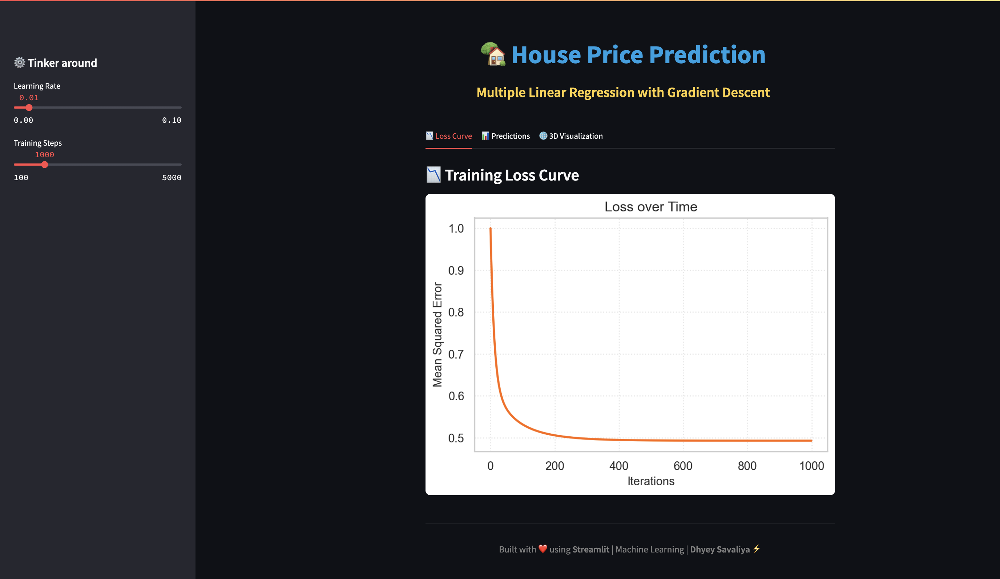
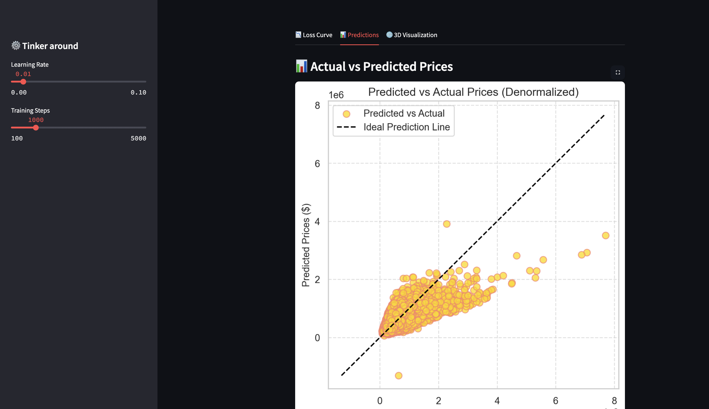
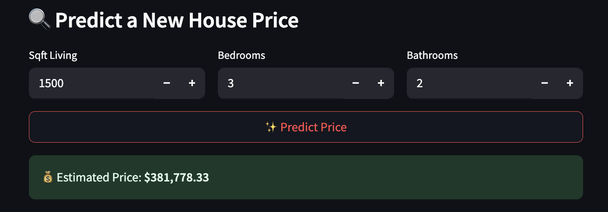
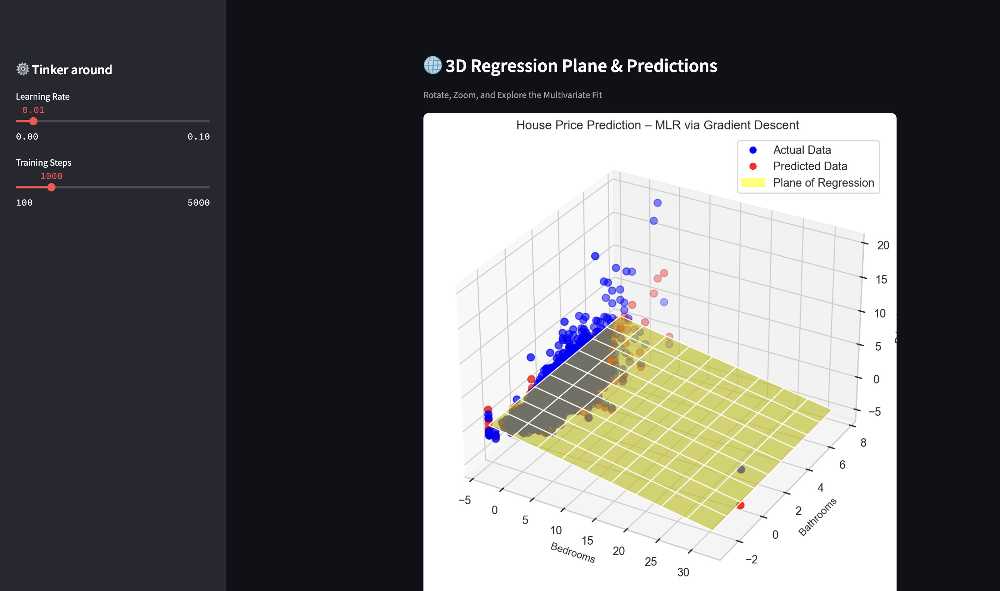

# 🏡 House Price Prediction – Multiple Linear Regression

> A complete end-to-end machine learning project using manual multiple linear regression (no scikit-learn!), visualized beautifully using Streamlit. Predict house prices using just square footage, bedrooms, and bathrooms!

---

## 📌 Overview

This project implements a **Multiple Linear Regression** model *from scratch* using **Gradient Descent** to predict house prices. Unlike pre-built libraries, everything from standardization to optimization is done manually — making it perfect for learning the core of ML!

---

## 🔍 Features

- ✨ **Manual Gradient Descent** (no `sklearn`)
- 📉 **Loss Curve** plotted across iterations
- 📊 **Actual vs Predicted** plot (denormalized)
- 🌐 **Interactive 3D Visualization** of regression plane
- 🔮 **Custom Prediction Input** via UI
- 📋 **Streamlit Web App** – Clean, responsive, aesthetic
- 🧠 **Educational project** – ideal for resumes, learning

---

## 📁 Project Structure
[Dataset here.](https://www.kaggle.com/datasets/harlfoxem/housesalesprediction)
```bash
/HousePricePrediction
├── kc_house_data.csv # Dataset
├── linear_regression.py # All ML logic & plots
├── app.py # Streamlit interactive app
├── README.md # This file
├── requirements.txt # Dependencies
└── /images
    ├── 1.png
    ├── 2.png
    ├── 3.png
    └── 4.png
```
---

## 📸 Preview
### 📉 Loss Curve


### 📊 Actual vs Predicted Prices


### ❓ Interactive Prediction


### 🌐 3D Regression Plane


---
## 🧑‍💻 Installation & Usage

### ✅ Prerequisites

Ensure Python ≥ 3.7 is installed.

```bash
git clone https://github.com/yourusername/HousePricePrediction.git
cd HousePricePrediction
pip install -r requirements.txt
```
Or manually : 

```bash
pip install pandas numpy matplotlib seaborn streamlit
```

### 🚀 Run the app
```bash
streamlit run app.py
```
Open your browser to: `http://localhost:8501`
---

## 🧠 How It Works

1. **Preprocessing**
   - Loads `sqft_living`, `bedrooms`, `bathrooms`, and `price`
   - Standardizes all features

2. **Gradient Descent**
   - Initializes weights to `0`
   - Updates them using MSE loss gradient
   - Tracks loss at each step

3. **Prediction**
   - Computes dot product of weights and user inputs
   - Outputs denormalized prediction in Streamlit app

4. **Visualization**
   - Plots actual vs predicted prices
   - Renders a 3D regression plane for analysis

---
> Built with ❤️ using [Streamlit](https://streamlit.io)  
> Manual Machine Learning | Author: Dhyey Savaliya ⚡

